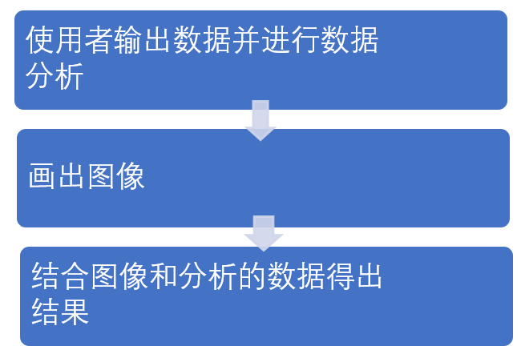
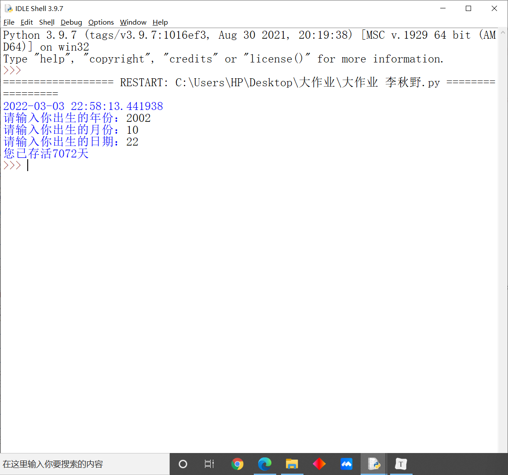
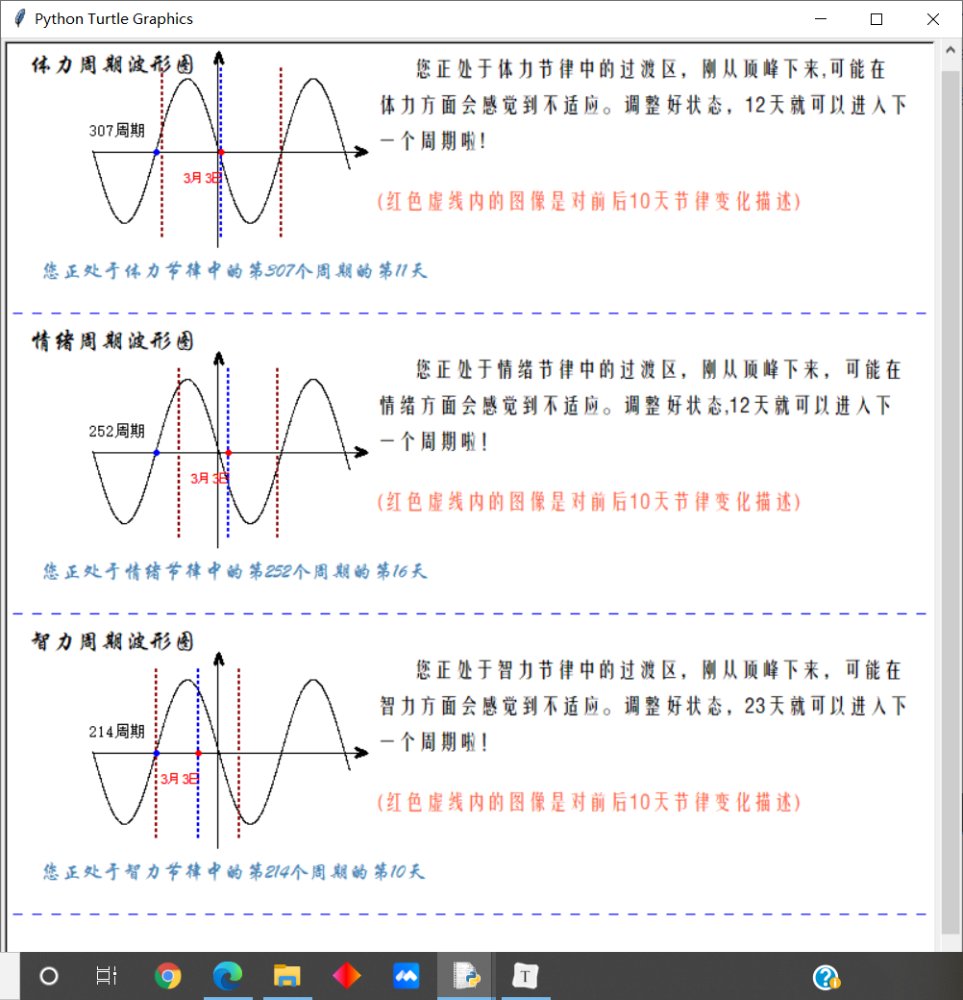

#                                              人体节律波形图开发

## 一、 程序整体介绍

### 		1. 程序功能

使用者输入的出生日期，输出当天精确时间、使用者存活的天数，判断使用者处于第几个生物节律（体力、情绪、智力）并用画图的方式来直观的展现。最后用评语的方式进行输出。

### 		2. 理论支持

>  生物节律是自然进化赋予生命的基本特征之一,人类和一切生物都要受到生物节律的控制与影响。人体生物节律是指体力节律、情绪节律和智力节律。每个人从他出生那天起一直到生命终结,都存在着体力2天、情绪28天、智力33天的周期性波动规律,称为人体生物节律。每一个周期中又存在着高潮期、低潮期和临界期。由于它具有准确的时间性，因此，也称之为人体生物钟。在我们日常生活中，有人会觉得自己的体力、情绪或智力有时很好，有时很坏，人从他诞生之日起，直至生命终结，其自身的体力、情绪和智力都存在着由强至弱、由弱至强的周期性起伏变化。人们把这种现象称作生物节律，或生物节奏、生命节律等。产生这种现象的原因是生物体内存在着生物钟它自动地调节和控制着人体的行为和活动。

## 二、逻辑顺序

### 		1. 表格形式

|    思路    | 调用库函数-->数据(计算天数)-->计算各周期的周期数及天数-->画出正弦函数图-->在图中标明数据-->根据数据画出该点在图像中的位置-->根据坐标判断在周期中的位置并打印评语-->装饰 |
| :--------: | ------------------------------------------------------------ |
| 函数体顺序 | 计算各周期的周期数及天数-->正弦函数图(正弦+坐标轴+箭头)-->标示数据(周期+日期+位置)-->具体位置(当天+前后10天)-->打印评语-->装饰 |
|  注意事项  | 函数初始位置引入turtle库并简写为t；引入math库；引入datetime库并简写为dt |

### 		2. 框图模式



## 三、函数介绍

### 	1. 函数简介

#### 			1.1 计算周期的函数

|              函数              |         参数名         |                           参数解释                           |              函数作用              |
| :----------------------------: | :--------------------: | :----------------------------------------------------------: | :--------------------------------: |
| now_day(today_month,today_day) | today_month，today_day |          today_month-今天的月份today_day-今天的日期          |     用来计算这个月你存活的天数     |
| before_day(use_month,use_day)  |   use_month，use_day   |       use_month-使用者出生月份；use_day-使用者出生日期       | 用来计算你从出生到第一年的存活天数 |
| year_day(use_year,today_year)  |  use_year，today_year  |        use_year-使用者出生年份；today_year-当今的年份        |    用来计算你中间年份的存活天数    |
| all_day(sum1,sum2,differ_day)  | sum1；sum2;differ_day  | sum1-这个月你存活的天数；sum2-你从出生到第一年的存活天数;differ_day-你中间年份的存活天数 |      你从出生到现在存活的天数      |

#### 			1.2 用来画坐标图图的函数

|     函数      | 参数名 |    参数解释    |        函数作用        |
| :-----------: | :----: | :------------: | :--------------------: |
|   sin(move)   |  move  | 向下平移的距离 |      画出sin图像       |
| x_arrow(move) |  move  | 向下平移的距离 |     画出x轴的箭头      |
| y_arrow(move) |  move  | 向下平移的距离 |     画出y轴的箭头      |
|  axis(move)   |  move  | 向下平移的距离 | 画出坐标系（不带箭头） |
|  all_axis()   |   无   |       无       |  画出带有箭头的坐标系  |

#### 			1.3 对坐标图进行详细标记的函数

|           函数            |   参数名   |                      参数解释                      |              函数作用              |
| :-----------------------: | :--------: | :------------------------------------------------: | :--------------------------------: |
|   information(x,y,sign)   |  x,y,sign  |         x-x坐标;y-y坐标;sign-表示什么类型          |     在坐标图中标明是什么坐标系     |
|     write_T(move,num)     |  move,num  |         move-向下平移的距离;num-第几个周期         |     在坐标图中标明是第几个周期     |
| py_write_date(DAY1,move） | DAY1,move  |     DAY1-当前周期的第几天;move-向下平移的距离      | 在体力坐标图中标明当天的位置和日期 |
| py_write_date(DAY1,move） | DAY1,move  |     DAY1-当前周期的第几天;move-向下平移的距离      | 在情绪坐标图中标明当天的位置和日期 |
| py_write_date(DAY1,move） | DAY1,move  |     DAY1-当前周期的第几天;move-向下平移的距离      | 在智力坐标图中标明当天的位置和日期 |
|    dotline(x1,move,jd)    | x1;move;jg | x1-x坐标;move-向下平移的距离;jd-判断颜色为红还是蓝 |   在智力坐标图中垂直x轴画出虚线    |

#### 			1.4 对数据进行分析并打印分析结果的函数

|                     函数                      |             参数名              |                           参数解释                           | 函数作用                                           |
| :-------------------------------------------: | :-----------------------------: | :----------------------------------------------------------: | -------------------------------------------------- |
| writecontent(move,content1,content2,content3) | content1;content2;content3;move | content1-什么周期;content2-第几个;content3-第几天;move-向下平移的距离 | 写出当前日期处于第几个周期的第几天                 |
|          writedetail(types,day,move)          |         types;day;move          | types-什么周期;day-当天日期在周期中的第几天;move-向下平移的距离 | 准确描述当前日期处于周期的位置并对前后10天进行说明 |
|               des_dotline(move)               |              move               |                     move-向下平移的距离                      | 对虚线的解释                                       |
|              decorate(x,y,color)              |            x,y,color            |               x-x坐标;y-y坐标;color-虚线的颜色               | 将3个分区隔离开                                    |

### 2.重要函数详细介绍

#### 		2.1 计算出生天数的函数

##### 				2.1.1 函数部分

```python
months = [0,31,59,90,120,151,181,212,243,273,304,334]

def now_day(today_month,today_day):#用来计算这个月你存活的天数
    if 0 <= today_month <= 12:
        add = months[today_month - 1]
    else:
        print ('输入错误')
    add += today_day
    return add

def before_day(use_month,use_day):#用来计算你从出生到第一年的存活天数
    if 0 <= use_month <= 12:
        add = months[use_month - 1]
    else:
        print ('输入错误')
    add += use_day                #（用来判断是否为闰年）
    if (use_month % 400 == 0) or ((use_month % 4 == 0) and (use_month % 100 != 0)):
        add = 366 - add
    else:
        add = 365 - add
    return add

def year_day(use_year,today_year):#用来计算你中间年份的存活天数
    global year_differ_day
    while(use_year < today_year - 1):
        if (use_year % 400 == 0) or ((use_year % 4 == 0) and (use_year % 100 != 0)):
            year_differ_day += 366
            use_year += 1
        else:
            year_differ_day += 365
            use_year += 1
    return year_differ_day

def all_day(sum1,sum2,differ_day):#计算你从出生到现在存活的天数
    all_day = sum1 + sum2 + differ_day
    print(all_day)
    return all_day

sum1 = now_day(today_month,today_day) 
sum2 = before_day(use_month,use_day)
year_differ_day = year_day(use_year,today_year)
all_day = all_day(sum1,sum2,year_differ_day)
```

##### 			2.1.2 框图原理


#### 	2.2 计算个周期及天数的表达式

```python
#体力
py_T = all_day//23    #处于第几个周期
py_day = all_day%23   #处于第几个周期的第几天
#情绪
em_T = all_day//28
em_day = all_day%28
#智力
in_T = all_day//33
in_day = all_day%33
```

#### 	2.3 画正弦函数

```python
def sin(move):#用来画正弦函数
    i=-218
    t1.penup()
    t1.goto(-318,299.2-move)
    t1.pendown()
    while(i<=-4):
        i = i + 0.1
        y = -60*math.sin(0.06*i+0.5)
        t1.goto(i-100,y+300-move)
```

引用了math库中的sin函数。该函数可表示为y=sin(x)，输入x的值（弧度制），得到相应的纵坐标。在上述函数中，y = -60*math.sin(0.06*i+0.5)，-60控制sin函数的最大和最小值在[-60,60]。 输入x，返回y的值。这样为一个点，当x值的数量足够多的时候就变成了线了。（式子中的数据都为试验得出的）

#### 	2.4 在波形图上表明当前日期的位置

##### 			2.4.1 体力

```python
def py_write_date(DAY1,move):#在波形图上表明当前日期的位置              DAY1表达当前在周期内的第几天
    x1 = -265 + DAY1*4.95
    t1.penup()
    t1.goto(x1,299.2-move)
    t1.pencolor('red')
    t1.dot(6)               #t1.dot(6) 表示在此位置画一个(t.dot(color,pensize)).
    t1.pencolor('black')
    t1.pendown()
    t1.penup()
    t1.pencolor('red')
    t1.goto(x1-30,270.2-move)
    t1.pendown()
    t1.write('{}月{}日'.format(today_month,today_day))
    return x1
```

x1=-265+DAY1*4.95中，4.95 =（sin图一个周期长度/体力周期数）。-265为上一个周期末位置也为折一个周期开始位置的横坐标。根据DAY1 * 4.95可得到当前天数在坐标轴上平移的距离。返回到值X1为画虚线的横坐标，下面也是一样，只不过***sin图一个周期长度/体力周期数***不同。

##### 			2.4.2 情绪

```python
def em_write_date(DAY1,move):#在波形图上表明当前日期的位置              DAY1表达当前在周期内的第几天
    x1 = -270 + DAY1*4.07
    t1.penup()
    t1.goto(x1,299.2-move)
    t1.pencolor('red')
    t1.dot(6)
    t1.pencolor('black')
    t1.pendown()
    t1.penup()
    t1.pencolor('red')
    t1.goto(x1-30,270.2-move)
    t1.pendown()
    t1.write('{}月{}日'.format(today_month,today_day))
    return x1
```


##### 			2.4.3 智力

```python
def in_write_date(DAY1,move):#在波形图上表明当前日期的位置              DAY1表达当前在周期内的第几天
    x1 = -265 + DAY1*3.45
    t1.penup()
    t1.goto(x1,299.2-move)
    t1.pencolor('red')
    t1.dot(6)
    t1.pencolor('black')
    t1.pendown()
    t1.penup()
    t1.pencolor('red')
    t1.goto(x1-30,270.2-move)
    t1.pendown()
    t1.write('{}月{}日'.format(today_month,today_day))
    return x1
```

#### 	2.5 在波形图上用虚线表明当前日期及前后10天的区间

```python
#体力周期图
information(-370,360,'体力') #写是什么波形图
write_T(0,py_T)             #写是第几个
py_write_date(py_day,0)
x = py_write_date(py_day,0)
dotline(x,0,1)        #dotline(x1,move,jd) x1-纵坐标 move-向下平移的位置 jd=1蓝色;jd=0红色
dotline(x-10*4.95,0,0)
dotline(x+10*4.95,0,0)
#情绪周期图
information(-370,130,'情绪')
write_T(250,em_T)
em_write_date(em_day,250)
x = em_write_date(em_day,250)
dotline(x,250,1)
dotline(x-10*4.07,250,0)
dotline(x+10*4.07,250,0)
#智力周期波形图
information(-370,-120,'智力')
write_T(500,in_T)
in_write_date(in_day,500)
x = in_write_date(in_day,500)
dotline(x,500,1)
dotline(x-10*3.45,500,0)
dotline(x+10*3.45,500,0)
```

#### 2.6 判断及评语

##### 		2.6.1 主要评语

```python
def writedetail(types,day,move):#准确描述当前日期处于周期的位置并对前后10天进行说明
    t2.penup()                  #types-什么周期  day-当天日期在周期中的第几天
    t2.goto(-50,360-move)
    t2.pendown()
#--------------------------------------------------------------------------------
    if types == '体力':
        if day == 0 or day == 23:
            cir = 5.75     #1/4个周期的天数
            t2.write('您正处于{}节律周期的开始，会在{}天内到达顶峰'.format(types,cir), font=("方正姚体",13, "normal"))
        elif 0 < day < 6:  #处于前1/4个周期
            cir = 6 - day
            t2.write('您正处于{}节律周期的开始，会在{}天内到达顶峰'.format(types,cir), font=("方正姚体",13, "normal"))
        elif day == 6:     #处于第一个顶峰
            t2.write('您正处于{}节律中的巅峰期，珍惜机会哦'.format(types), font=("方正姚体",13, "normal"))
        elif 6 < day < 18: #处于过渡期
            cir = 23 - day
            t2.write('您正处于{}节律中的过渡区，刚从顶峰下来,可能在'.format(types), font=("方正姚体",13, "normal"))
            t2.penup()
            t2.goto(-80,330-move)
            t2.pendown()
            t2.write('{}方面会感觉到不适应。调整好状态，{}天就可以进入下'.format(types,cir), font=("方正姚体",13, "normal"))
            t2.penup()
            t2.goto(-80,300-move)     #分开写是为了更好看
            t2.pendown()
            t2.write('一个周期啦!', font=("方正姚体",13, "normal"))
        elif day == 18:  #处于低谷
            t2.write('您正处于{}节律中的低谷，加油，怎么走都是向上！'.format(types), font=("方正姚体",13, "normal"))
        elif 18 <day < 23:
            cir = 23 - day + 5
            t2.write('您正处于{}节律中的过渡区，刚从低谷出来。调整好状态，'.format(types), font=("方正姚体",13, "normal"))
            t2.penup()
            t2.goto(-80,330-move)
            t2.pendown()
            t2.write('{}此后{}天内都是上升趋势!'.format(types,cir), font=("方正姚体",13, "normal"))
#--------------------------------------------------------------------------------      
    elif types == '情绪':
        if day == 0 or day == 28:
            cir = 7
            t2.write('您正处于{}节律周期的开始，会在{}天内到达顶峰'.format(types,cir), font=("方正姚体",13, "normal"))
        elif 0 < day < 6:
            cir = 7 - day
            t2.write('您正处于{}节律周期的开始，会在{}天内到达顶峰'.format(types,cir), font=("方正姚体",13, "normal"))
        elif day == 7:
            t2.write('您正处于{}节律中的巅峰期，珍惜机会哦'.format(types), font=("方正姚体",13, "normal"))
        elif 7 < day < 21:
            cir = 28 - day
            t2.write('您正处于{}节律中的过渡区，刚从顶峰下来，可能在'.format(types), font=("方正姚体",13, "normal"))
            t2.penup()
            t2.goto(-80,330-move)
            t2.pendown()
            t2.write('{}方面会感觉到不适应。调整好状态,{}天就可以进入下'.format(types,cir), font=("方正姚体",13, "normal"))
            t2.penup()
            t2.goto(-80,300-move)
            t2.pendown()
            t2.write('一个周期啦！', font=("方正姚体",13, "normal"))
        elif day == 21:
            t2.write('您正处于{}节律中的低谷，加油，怎么走都是向上！'.format(types), font=("方正姚体",13, "normal"))
        elif 21 <day < 28:
            cir = 28 - day + 7
            t2.write('您正处于{}节律中的过渡区，刚从低谷出来。调整好状态，'.format(types), font=("方正姚体",13, "normal"))
            t2.penup()
            t2.goto(-80,330-move)
            t2.pendown()
            t2.write('{}此后{}天内都是上升趋势！'.format(types,cir), font=("方正姚体",13, "normal"))
#--------------------------------------------------------------------------------            
    elif types == '智力':
        if day == 0 or day == 33:
            cir = 8
            t2.write('您正处于{}节律周期的开始，会在{}天内到达顶峰'.format(types,cir), font=("方正姚体",13, "normal"))
        elif 0 < day < 8:
            cir = 8 - day
            t2.write('您正处于{}节律周期的开始，会在{}天内到达顶峰'.format(types,cir), font=("方正姚体",13, "normal"))
        elif day == 8:
            t2.write('您正处于{}节律中的巅峰期，珍惜机会哦'.format(types), font=("方正姚体",13, "normal"))
        elif 8 < day < 25:
            cir = 33 - day
            t2.write('您正处于{}节律中的过渡区，刚从顶峰下来，可能在'.format(types), font=("方正姚体",13, "normal"))
            t2.penup()
            t2.goto(-80,330-move)
            t2.pendown()
            t2.write('{}方面会感觉到不适应。调整好状态，{}天就可以进入下'.format(types,cir), font=("方正姚体",13, "normal"))
            t2.penup()
            t2.goto(-80,300-move)
            t2.pendown()
            t2.write('一个周期啦！', font=("方正姚体",13, "normal"))
        elif day == 25:
            t2.write('您正处于{}节律中的低谷，加油，怎么走都是向上'.format(types), font=("方正姚体",13, "normal"))
        elif 25 <day < 33:
            cir = 33 - day + 8
            t2.write('您正处于{}节律中的过渡区，刚从低谷出来。调整好状态，'.format(types), font=("方正姚体",13, "normal"))
            t2.penup()
            t2.goto(-80,330-move)
            t2.pendown()
            t2.write('{}此后{}天内都是上升趋势！'.format(types,cir), font=("方正姚体",13, "normal"))
```

##### 2.6.2 对虚线的解释

```python
def des_dotline(move):#对虚线的解释
    t2.penup()
    t2.goto(-80,250-move)
    t2.pendown()
    t2.pencolor('tomato')
    t2.write('(红色虚线内的图像是对前后10天节律变化描述)', font=("方正姚体",13, "normal"))
    t2.pencolor('black')
```

## 四、运行效果





#### 